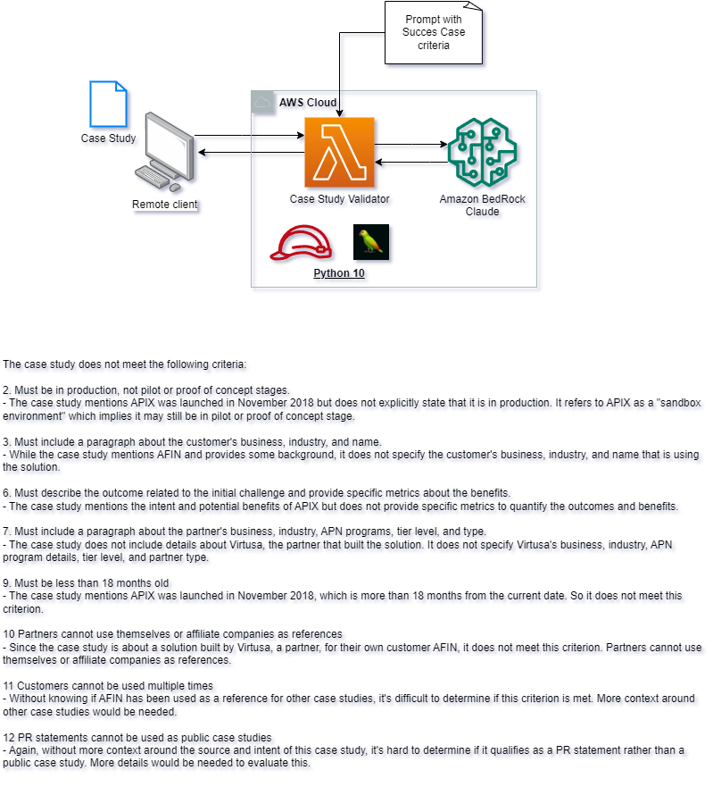

# Deploying a lambda function with Langchain for consuming a Bedrock Foundational Model

## Use case: success stories validation (see diagram)



## Assumptions
* You have access and permissions to use Amazon Bedrock
* Using python 3.10
* AWS CLI is installed and properly configured
* CDK is installed and configured


# Lambda layer libraries

inside your cdk project, create a ```lambda``` directory

inside the lamdba directory, create a ```layer``` directory

go to the root of your cdk project and run:

```
cd lambda\layer
pip install --platform manylinux2014_x86_64 --target=.\python\lib\python3.10\site-packages --implementation cp --python 3.10 --only-binary=:all: --upgrade https://github.com/hwchase17/langchain/releases/download/v0.0.219/langchain-0.0.219-py3-none-any.whl
```
